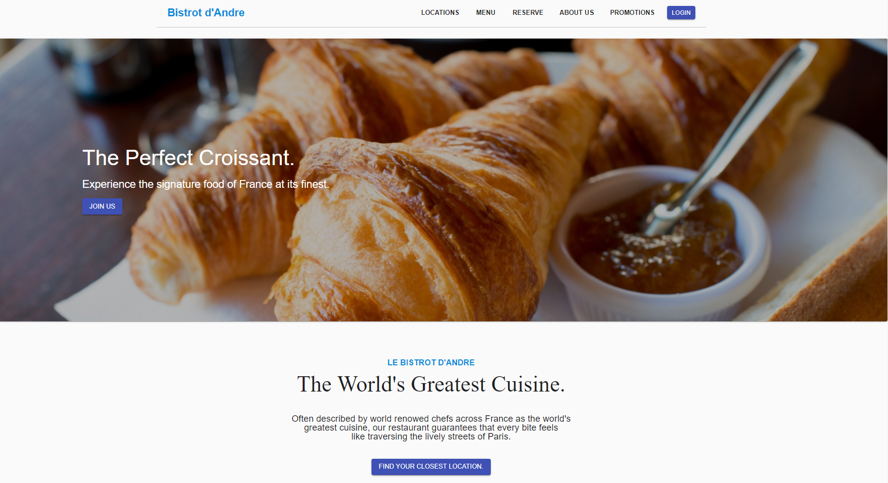

<br/>
<p align="center">
  <a href="https://github.com/HimalayanPanda/SES10_eRestaurant">
    
  </a>

  <h3 align="center">Software Engineering Studio 1A</h3>

  <p align="center">
    Group 10 - eRestaurant System
    <br/>
    <br/>
  </p>
</p>


## About The Project



For this project, we were assigned to make an online eRestaurant system for the restaurant Le Bistrot d'Andre

Some of the requirements of the system are as follows:
* Customers should be able to register, log in, create reservations and create meal orders with the system.
* Staff should have access to the system, view reservation, and interact with some of the system's features.
* The administrator must have special features that include adding and managing staff account.


## Built With

This project was built with the MERN stack.
* MongoDB as the database.
* Express.js for the backend.
* React.js for the frontend.
* Node.js for the backend.

Additionally, we used Material UI for the design. 

## Getting Started

To get a local copy up and running follow these simple example steps.

### Prerequisites

Node.js needs to be installed.

### Installation

1. Clone the repo

   ```sh
   git clone https://github.com/HimalayanPanda/SES10_eRestaurant.git
   ```

2. Go into the Frontend/Client directory 

   ```sh
   cd frontend/client
   ```

3. Run npm install
   ```sh
   npm install
   ```

4. Run the launch script
   ```sh
   npm run launch
   ```

## License

Distributed under the MIT License.

## Authors

* **Aditya Raj Pandey** - *Software Engineering Student* - [GitHub](https://github.com/HimalayanPanda)
* **Tamsin Low** - *Software Engineering Student* - [GitHub](https://github.com/tam-debug)
* **Isobel Bennet** - *Software Engineering Student* - [GitHub](https://github.com/isbennett)
* **Christopher Le** - *Software Engineering Student* - [GitHub](https://github.com/oSirhcel) 
